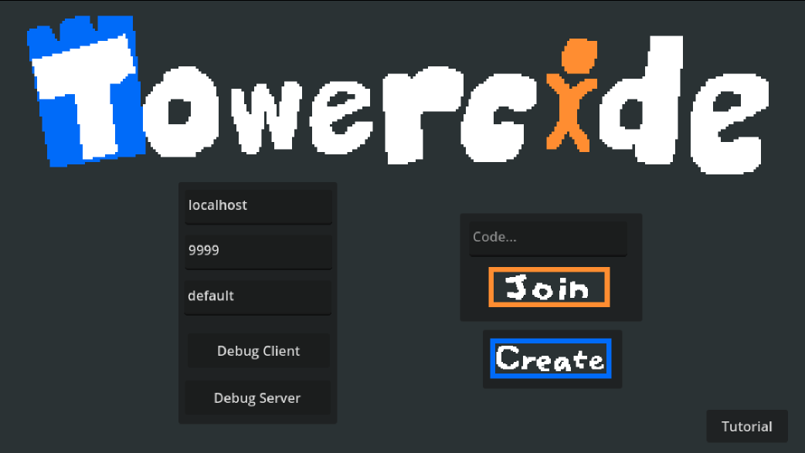

# Towercide
A fast-paced multiplayer platformer where you battle against other players in real-time! Jump, attack, and outmaneuver your opponents in this action-packed game.

    
    

## Development
Towercide was made in 48 hours, with some pre-work to learn about multiplayer networking, by the [YGDA](https://ygda.org) Game Lab Team. 

## How to Play

1. Download the game
2. Create or join a match
3. Battle against other players
4. Be the last one standing!

## Development

Built with:
- Godot 4.x
- FastAPI
- WebSocket networking
- Docker containerization
